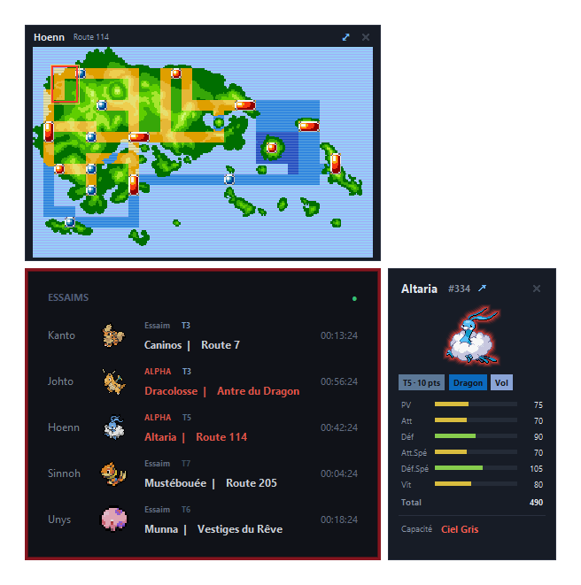

# PokeMMO Swarm Widget



*Deux alphas en cours — Dracolosse à Johto, Altaria à Hoenn — en rouge, d'où le
halo qui entoure le widget ; les trois autres régions sont de simples essaims.
À droite, la fiche d'Altaria avec son sprite auréolé, ses deux types et sa
capacité figée. Au-dessus, la carte de Hoenn, Route 114 encadrée.*

[](LICENSE)
[](https://www.python.org/)
[](#installation)
[](requirements.txt)

**Un panneau posé sur le bureau qui montre les essaims et les alphas PokeMMO des
cinq régions, en temps réel — sans lancer le jeu.**

Un essaim dure environ 25 minutes, un alpha 75. Les repérer suppose d'ouvrir la
carte du jeu régulièrement, donc de jouer, donc de rester connecté. Ce widget
retire cette contrainte : il écoute les annonces de la communauté et les affiche
dans un petit panneau toujours visible, que le jeu tourne ou non.

---

## Ce que ça fait

| | |
|---|---|
| **Cinq régions à la fois** | Kanto, Johto, Hoenn, Sinnoh, Unys — une ligne chacune, deux emplacements par région (un essaim *et* un alpha peuvent coexister) |
| **Sans lancer le jeu** | les données viennent du flux public d'Alphapedia, pas du client |
| **Compte à rebours à la seconde** | `hh:mm:ss`, qui sert aussi de témoin de vie |
| **Noms français** | Pokémon *et* lieux, depuis les tables d'Alphapedia |
| **Fiche Pokédex** | rareté, types colorés, six jauges de statistiques, capacité figée des alphas |
| **Cartes de région** | 486 lieux repérés sur les cartes officielles, plus 49 cartes annotées par la communauté |
| **Alphas signalés** | badge rouge, sprite cerclé de rouge, halo pulsant autour du widget |
| **Cri du Pokémon** | joué une fois à chaque nouvelle apparition — **muet par défaut**, volume réglable et retenu |
| **Pokédex de recherche** | cherche une espèce par son nom, montre ses stats et **par quoi la battre** |
| **Discret** | translucide au repos, opaque au survol, ancrable au bureau ou au premier plan |
| **Rien sur le disque** | l'état vit en mémoire ; seuls position, échelle et transparence sont retenus |
| **Aucune dépendance** | bibliothèque standard uniquement, Pillow compris |

---

## Installation

**Prérequis** : Windows 10 ou 11, Python 3.10+ avec tkinter (inclus dans
l'installeur officiel de [python.org](https://www.python.org/)).

```powershell
git clone https://github.com/<toi>/pokemmo-swarm-widget.git
cd pokemmo-swarm-widget
python fetch_assets.py      # une seule fois : sprites et cartes
pythonw swarm_widget.py
```

Ou double-clic sur `start_widget.cmd`.

`fetch_assets.py` télécharge ce que le dépôt ne peut pas contenir : 649 icônes,
649 grandes images, 649 variantes à halo rouge et 649 cris — environ 11 Mo, plus
42 Mo si tu gardes les cartes annotées de la communauté. Les données dérivées
(noms, raretés, coordonnées des lieux) sont, elles, versionnées : inutile de les
reconstruire.

> Rien à installer avec `pip`. `requirements.txt` est vide de dépendances et
> documente simplement les prérequis.

---

## Utilisation

```powershell
pythonw swarm_widget.py
```

`pythonw` plutôt que `python` : aucune fenêtre de console. **Sans aucun
argument**, le widget suit le serveur ntfy public d'Alphapedia — alphas et
essaims des cinq régions, aucun compte à créer. Il se ferme depuis l'icône de la
zone de notification.

### Options

```powershell
pythonw swarm_widget.py ^
    --feed https://serveur/topic1,topic2   # repetable
    --topic <ton-topic>                    # raccourci sur --server
    --server https://ntfy.sh               # serveur associe a --topic
    --pin top^|desktop                     # premier plan (defaut) ou colle au bureau
    --lang fr^|en                          # langue des noms (defaut fr)
    --scale 0.85                           # echelle GLOBALE : texte, marges, sprites
    --sprite-scale 1.0                     # multiplicateur sur les seuls sprites
    --opacity 0.97                         # opacite au survol
    --idle-opacity 0.72                    # opacite au repos ; 1.0 pour desactiver
    --rarity tier^|points^|none            # rang seul (defaut), + bareme, ou rien
    --seed 12h^|none                       # historique rejoue au demarrage
    --demo                                 # scene fixe, sans reseau
```

`--scale` agit sur **tout l'ensemble** — c'est le réglage pour agrandir ou
réduire le widget d'un bloc ; `--sprite-scale` vient par-dessus, pour les seuls
sprites. `--demo` remplit le widget sans réseau et ouvre fiche et carte : utile
pour voir l'interface sans attendre, un essaim ne tombant que toutes les ~45 min.

### Au démarrage de Windows

```powershell
powershell -ExecutionPolicy Bypass -File install_startup.ps1
```

Crée un raccourci dans `shell:startup`. Aucune écriture dans le registre, aucun
droit administrateur. Pour désactiver : `install_startup.ps1 -Remove`.

---

## En un coup d'œil

| Pastille | Sens |
|---|---|
| 🟢 vert **clignotant** | au moins un essaim en cours |
| 🔵 bleu fixe | connecté, aucun essaim |
| 🟠 orange | connexion en cours |
| 🔴 rouge | déconnecté (reconnexion automatique) |

| Geste | Effet |
|---|---|
| Survol d'un sprite ou d'un nom | le sprite grossit, le nom s'accentue |
| Clic sur le **sprite** ou le **nom** | ouvre la fiche Pokédex ; un second clic la referme |
| Clic sur le **nom du lieu** | ouvre la carte de la région ; un second clic la referme |
| Clic sur le **repère** de la carte | bascule sur la carte annotée de la communauté, avec **←** pour revenir |
| **Double-clic** sur la carte | agrandit, ou revient à la taille normale |
| **✕** ou `Échap` | ferme le panneau |
| Clic sur le **🔇 / 🔊** après le titre | coupe ou rétablit le cri du Pokémon |
| Clic sur le **🔍** à gauche de la pastille | ouvre le Pokédex de recherche |

Le cri est joué **une fois** à chaque nouvelle apparition. Le widget démarre
toujours **muet** ; le volume, lui, est retenu d'une session à l'autre. Deux
essaims coup sur coup se suivent au lieu de se superposer.

Le widget se déplace à la souris. Taille, transparence, ancrage, son et volume
se règlent aussi depuis l'icône de la zone de notification.

---

## Documentation

Le détail vit dans [`docs/`](docs/) :

| Page | Contenu |
|---|---|
| [**L'interface en détail**](docs/interface.md) | fiche Pokédex, cartes de région et cartes annotées, ce qui change pour un alpha, halo et transparence, menu de l'icône système |
| [**Les flux de données**](docs/donnees.md) | les deux flux ntfy, configurer son propre topic, essaims contre alphas, durée d'un essaim, format réel d'Alphapedia et fiabilité mesurée |
| [**Sous le capot**](docs/sous-le-capot.md) | d'où viennent noms, sprites, raretés et cartes ; rognage des sprites, halo des alphas, reconstitution des cartes de région |

---

## Ce que ce widget ne fait jamais

- toucher au process du jeu ou à sa mémoire,
- toucher au trafic réseau du jeu,
- envoyer des entrées clavier ou souris — **aucune automatisation de gameplay**.

**Pas d'anti-AFK, volontairement.** Bouger le curseur ou envoyer des touches
automatiquement tombe sous la clause des ToS visant « scripts, macros, bots,
autoclickers », et le client scanne la RAM à la recherche de programmes tiers.
Le flux Alphapedia supprime le besoin : le jeu n'a plus à tourner.

L'interception réseau était la piste initiale, techniquement faisable mais
inadaptée — les raisons sont détaillées dans
[Sous le capot](docs/sous-le-capot.md#pourquoi-pas-linterception-réseau).

---

## Limites connues

- **Windows uniquement.** L'icône système et l'ancrage au bureau passent par
  l'API Win32 via `ctypes`. Le reste est portable.
- **Dépendance à des contributeurs humains.** La source première est le jeu
  lui-même, auquel Alphapedia n'a pas accès : un joueur doit *signaler* l'essaim.
  Un essaim que personne ne signale n'apparaîtra jamais.
- **Le décompte est un majorant.** Il part du signalement, pas de l'apparition :
  un essaim signalé avec 15 min de retard affichera ~25 min restantes alors qu'il
  n'en reste qu'une dizaine. Cela vaut pour les deux flux.
- **Cartes annotées partielles** : 49 lieux, dont 6 en JPEG que Tk ne lit pas.
- **Sinnoh reste le repérage le moins précis** : faute de carte extractible, ses
  emprises passent par une transformation affine (94 % de recouvrement), là où
  les autres régions viennent directement des données de jeu.
- **PWT, Pokéwood et la Réserve Naturelle** n'ont pas de repère sur Unys : ce
  sont des installations sans spawn sauvage.

---

## Contribuer

Les contributions sont les bienvenues — voir [CONTRIBUTING.md](CONTRIBUTING.md)
pour la mise en place, le style et ce qui aiderait le plus.

En deux lignes : aucune dépendance tierce, aucune automatisation de jeu, rien
n'est journalisé. Le reste est ouvert à la discussion.

*Contributions welcome. The code and its comments are in French, but issues and
pull requests in English are perfectly fine.*

---

## Licence

[MIT](LICENSE) pour le code source.

La licence ne couvre **pas** les ressources de jeu que le projet télécharge à
l'exécution (sprites, cartes) ni les données lues chez des tiers.

---

## Crédits et mentions légales

| | |
|---|---|
| [Alphapedia](https://alpha.pokemmotools.org/) | source des essaims, alphas, raretés et traductions — par FlaProGmr & Lorddusk |
| [ntfy](https://ntfy.sh/) | transport push, et son [API de souscription](https://docs.ntfy.sh/subscribe/api/) |
| [PokeAPI](https://pokeapi.co/) / [PokeAPI/sprites](https://github.com/PokeAPI/sprites) | sprites et chaînes évolutives |
| [pret](https://github.com/pret) | décompilations `pokeemerald`, `pokefirered`, `pokecrystal`, `pokeplatinum` |
| [pokebip](https://www.pokebip.com/) | guide des lieux Noir/Blanc et Noir/Blanc 2 |
| [fanzeyi/pokemon.json](https://github.com/fanzeyi/pokemon.json) | numéros du Pokédex |
| [PokeMMO ShoutWiki](https://pokemmo.shoutwiki.com/) | durées des essaims, Shiny Wars |

Les scripts respectent les sites qu'ils interrogent : cache disque systématique,
pause entre les requêtes, et aucune ressource re-téléchargée sans `--force`.

> **PokeMMO Swarm Widget est un projet de fan non officiel**, sans aucun lien avec
> Nintendo, Creatures Inc., GAME FREAK Inc. ni l'équipe PokeMMO. Pokémon et les
> noms, sprites et cartes associés restent la propriété de leurs détenteurs
> respectifs. Aucune ressource de jeu n'est redistribuée par ce dépôt : elles
> sont téléchargées à l'exécution depuis leurs sources d'origine.
>
> Cet outil lit des annonces publiques et n'interagit jamais avec le client
> PokeMMO. Il reste de ta responsabilité de vérifier qu'il est compatible avec
> les conditions d'utilisation en vigueur.
